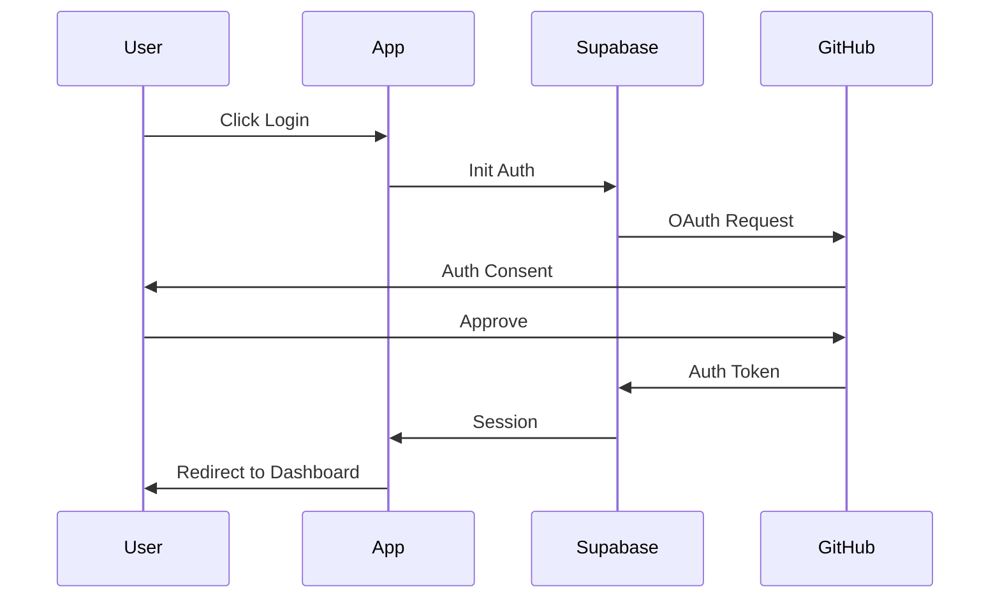
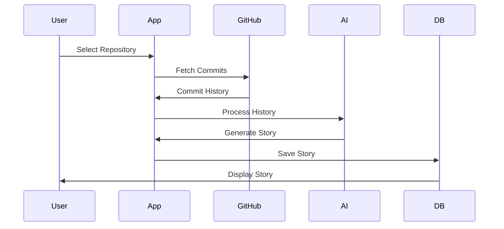

# Architecture Overview

## Core Technologies

- **Next.js 14**: Full-stack React framework with App Router
- **TypeScript**: Type-safe development
- **Supabase**: Authentication and PostgreSQL database
- **TailwindCSS**: Utility-first CSS framework
- **Shadcn UI**: Accessible component library
- **Lucide Icons**: Consistent icon system

## Application Structure

```
src/
├── app/                # Next.js app router pages
│   ├── (auth)/        # Authentication routes
│   ├── (dashboard)/   # Protected dashboard routes
│   ├── (marketing)/   # Public marketing pages
│   └── api/           # API routes
├── components/         # React components
│   ├── analytics/     # Analytics components
│   ├── auth/          # Authentication components
│   ├── dashboard/     # Dashboard components
│   ├── layout/        # Layout components
│   ├── marketing/     # Marketing components
│   ├── repositories/  # Repository components
│   ├── sections/      # Page sections
│   ├── settings/      # Settings components
│   ├── story/         # Story components
│   └── ui/            # Shadcn UI components
├── hooks/             # Custom React hooks
│   ├── api/          # API-related hooks
│   ├── settings/     # Settings hooks
│   └── vcs/          # VCS provider hooks
├── lib/              # Core libraries
│   ├── actions/      # Server actions
│   ├── supabase/     # Database client
│   ├── utils/        # Utility functions
│   └── vcs/          # VCS provider implementations
└── types/           # TypeScript types
```

## Key Features

### 1. Authentication

- Supabase Auth integration
- Multiple OAuth providers
- Protected routes
- Session management

### 2. VCS Integration

- Multiple VCS provider support
- Repository connection
- Commit history sync
- Provider abstraction layer

### 3. Story Generation

- AI-powered analysis
- Multiple narrative styles
- Code snippet integration
- Export capabilities

### 4. Marketing System

```typescript
// Example marketing component props
interface MarketingProps {
  // Page Header
  header: {
    title: string
    titleGradient?: string
    description: string
    size?: 'default' | 'large'
  }
  // Features Grid
  features: Array<{
    title: string
    description: string
    icon: LucideIcon
  }>
  // Process Steps
  steps: Array<{
    step: string
    title: string
    description: string
  }>
  // CTA Section
  cta: {
    title: string
    titleHighlight?: string
    description: string
    primaryCta: {
      text: string
      href: string
    }
    secondaryCta?: {
      text: string
      href: string
    }
  }
}
```

### 5. Settings Management

```typescript
interface SettingsUpdate {
  theme?: 'light' | 'dark' | 'system'
  notifications?: {
    email?: boolean
    push?: boolean
    inApp?: boolean
  }
  privacy?: {
    shareAnalytics?: boolean
    shareUsage?: boolean
  }
  accessibility?: {
    reduceMotion?: boolean
    highContrast?: boolean
    largeText?: boolean
  }
  advanced?: {
    experimentalFeatures?: boolean
    debugMode?: boolean
  }
}
```

## Design Principles

### 1. Server-First Approach

- React Server Components by default
- Server Actions for mutations
- Edge-optimized data fetching
- Streaming responses

### 2. Type Safety

- TypeScript throughout
- Zod schema validation
- Type-safe API routes
- Strict prop types

### 3. Design System

- Consistent color palette
- Primary-to-purple gradients
- Responsive design patterns
- Component-based architecture
- Reusable marketing sections
- Accessible UI patterns

### 4. Performance

- Edge runtime optimization
- Image optimization
- Component code splitting
- Minimal client JavaScript
- Optimized loading states

## Data Flow

### Authentication Flow



### Story Generation Flow



## Performance Considerations

### 1. Edge Computing

- Deploy close to users
- Minimize latency
- Optimize caching
- Streaming responses

### 2. Data Fetching

- Parallel requests
- Streaming responses
- Incremental loading
- Suspense boundaries

### 3. Asset Optimization

- Image optimization
- Font subsetting
- Code splitting
- Bundle analysis

## Future Enhancements

### 1. Additional VCS Providers

- GitLab integration
- Bitbucket integration
- Custom provider framework
- Migration tools

### 2. Enhanced Analytics

- Advanced metrics
- Custom reports
- Data visualization
- User insights

### 3. Performance Improvements

- Edge functions
- Caching strategies
- Bundle optimization
- Real-time updates
