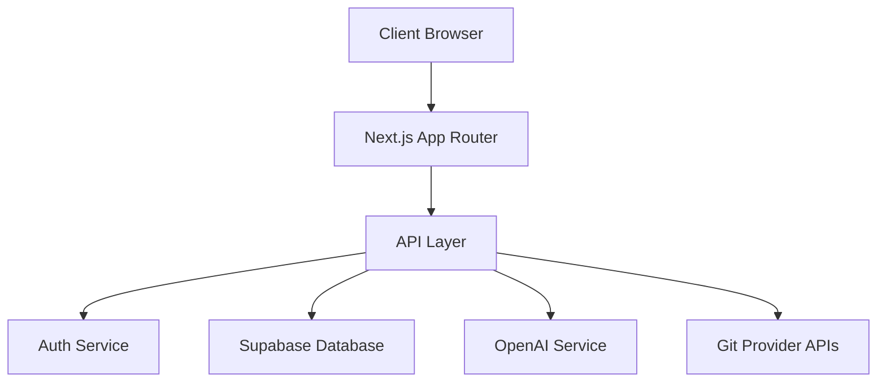
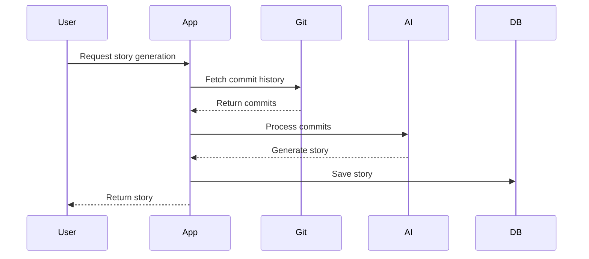
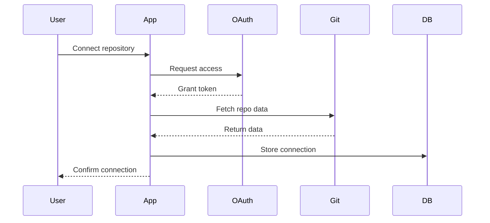

# GitFables Architecture

## System Overview

GitFables is built as a modern web application using Next.js 14, leveraging the App Router for server-side rendering and React Server Components.

### Architecture Diagram



## Core Components

### 1. Frontend Layer

#### Next.js App Router

- Server-side rendering
- React Server Components
- Client-side interactivity
- Static site generation
- API routes

#### UI Components

- React components
- Tailwind CSS styling
- shadcn/ui components
- Responsive design
- Accessibility support

### 2. API Layer

#### REST API

- RESTful endpoints
- OpenAPI specification
- Rate limiting
- Error handling
- Validation

#### GraphQL API

- Type-safe queries
- Real-time subscriptions
- Optimized data fetching
- Schema documentation

### 3. Authentication

#### Auth Flow

- OAuth 2.0 integration
- JWT tokens
- Session management
- Role-based access
- Security measures

### 4. Database

#### Supabase Integration

- PostgreSQL database
- Real-time capabilities
- Row-level security
- Full-text search
- Backup strategy

## Data Flow

### 1. Story Generation



### 2. Repository Integration



## Technical Stack

### Frontend

- Next.js 14
- React 18
- TypeScript
- Tailwind CSS
- shadcn/ui

### Backend

- Node.js
- tRPC
- OpenAI API
- Git Provider APIs
- WebSocket

### Database

- PostgreSQL
- Supabase
- Redis Cache

### Infrastructure

- Vercel deployment
- Edge functions
- CDN caching
- Asset optimization

## Security Measures

### Authentication

- OAuth 2.0
- JWT tokens
- HTTPS only
- CSRF protection
- Rate limiting

### Data Protection

- Encryption at rest
- Secure sessions
- Input validation
- Output sanitization
- XSS prevention

### API Security

- API key management
- Rate limiting
- Request validation
- Error handling
- Audit logging

## Performance Optimization

### Frontend

- Server components
- Static generation
- Image optimization
- Code splitting
- Bundle optimization

### Backend

- Caching strategy
- Query optimization
- Connection pooling
- Background jobs
- Rate limiting

### Database

- Indexing strategy
- Query optimization
- Connection pooling
- Backup strategy
- Monitoring

## Scalability

### Horizontal Scaling

- Stateless design
- Load balancing
- Service isolation
- Cache distribution
- Database sharding

### Vertical Scaling

- Resource optimization
- Memory management
- CPU utilization
- Storage efficiency
- Query optimization

## Monitoring and Logging

### Application Monitoring

- Error tracking
- Performance metrics
- User analytics
- System health
- API usage

### Logging Strategy

- Structured logging
- Log aggregation
- Error reporting
- Audit trails
- Analytics

## Development Workflow

### Local Development

```bash
# Install dependencies
npm install

# Start development server
npm run dev

# Run tests
npm run test

# Build production
npm run build
```

### Deployment Process

1. Code review
2. Automated testing
3. Staging deployment
4. Production release
5. Monitoring

## Configuration Management

### Environment Variables

```env
# App
NEXT_PUBLIC_APP_URL=http://localhost:3000

# Authentication
NEXTAUTH_URL=http://localhost:3000
NEXTAUTH_SECRET=your-secret

# Database
DATABASE_URL=your-database-url

# APIs
OPENAI_API_KEY=your-api-key
GITHUB_CLIENT_ID=your-client-id
GITHUB_CLIENT_SECRET=your-secret
```

### Feature Flags

```typescript
interface FeatureFlags {
  enableAI: boolean
  enableAnalytics: boolean
  enableWebhooks: boolean
  enableRealtime: boolean
}
```

## Error Handling

### Error Types

```typescript
interface AppError extends Error {
  code: string
  status: number
  details?: any
}

class APIError extends AppError {
  constructor(message: string, code: string, status: number) {
    super(message)
    this.code = code
    this.status = status
  }
}
```

### Error Responses

```typescript
interface ErrorResponse {
  error: {
    message: string
    code: string
    details?: any
  }
}
```

## Testing Strategy

### Unit Testing

- Component tests
- Service tests
- Utility tests
- Mock integration

### Integration Testing

- API endpoints
- Database queries
- External services
- Authentication

### E2E Testing

- User flows
- Critical paths
- Performance
- Security

## Documentation

### API Documentation

- OpenAPI spec
- Endpoint details
- Authentication
- Error codes
- Examples

### Code Documentation

- JSDoc comments
- Type definitions
- Usage examples
- Architecture docs
- Deployment guides

## Future Considerations

### Planned Improvements

1. GraphQL API expansion
2. Real-time collaboration
3. Advanced analytics
4. Custom AI models
5. Mobile applications

### Scalability Plans

1. Microservices architecture
2. Container orchestration
3. Global deployment
4. Edge computing
5. Data partitioning

## Resources

- [API Documentation](../api-reference.md)
- [Development Guide](../README.md)
- [Contributing Guide](../../CONTRIBUTING.md)
- [Security Policy](../../SECURITY.md)
