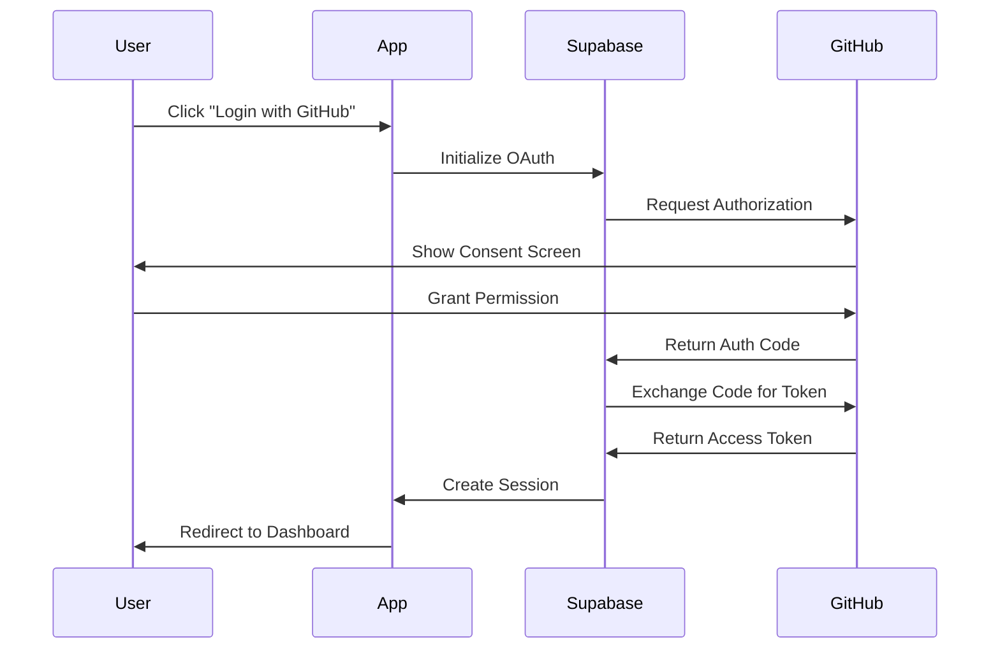
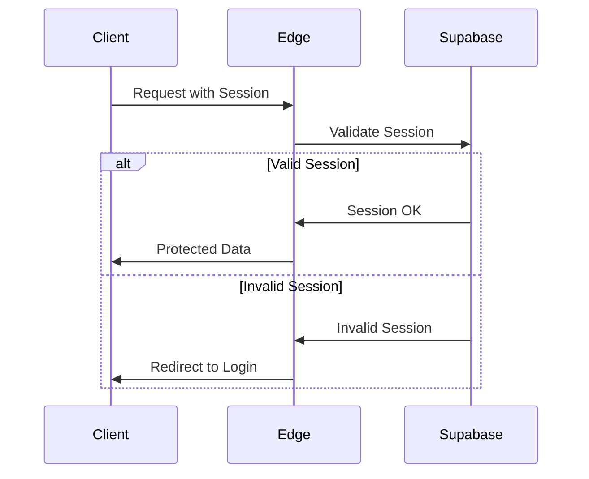

# Authentication & Authorization

## Overview

GitFables uses Supabase Auth for authentication and authorization, providing secure user management and OAuth integration with GitHub. The system implements a robust security model with Row Level Security (RLS) policies.

## Authentication Flow

### GitHub OAuth Flow



### Session Management



## Implementation Details

### 1. Client-Side Setup

```typescript
// lib/supabase/client.ts
import { createBrowserClient } from '@supabase/ssr'
import { Database } from '@/types/supabase'

export function createClient() {
  return createBrowserClient<Database>(
    process.env.NEXT_PUBLIC_SUPABASE_URL!,
    process.env.NEXT_PUBLIC_SUPABASE_ANON_KEY!
  )
}
```

### 2. Server-Side Setup

```typescript
// lib/supabase/server.ts
import { createServerClient } from '@supabase/ssr'
import { cookies } from 'next/headers'
import { Database } from '@/types/supabase'

export async function createClient() {
  const cookieStore = cookies()

  return createServerClient<Database>(
    process.env.NEXT_PUBLIC_SUPABASE_URL!,
    process.env.NEXT_PUBLIC_SUPABASE_ANON_KEY!,
    {
      cookies: {
        get(name) {
          return cookieStore.get(name)?.value
        },
        set(name, value, options) {
          cookieStore.set(name, value, options)
        },
        remove(name, options) {
          cookieStore.delete(name, options)
        },
      },
    }
  )
}
```

### 3. Middleware Protection

```typescript
// middleware.ts
import { createMiddlewareClient } from '@supabase/auth-helpers-nextjs'
import { NextResponse } from 'next/server'
import type { NextRequest } from 'next/server'

export async function middleware(req: NextRequest) {
  const res = NextResponse.next()
  const supabase = createMiddlewareClient({ req, res })
  const {
    data: { session },
  } = await supabase.auth.getSession()

  // Protect dashboard routes
  if (req.nextUrl.pathname.startsWith('/dashboard')) {
    if (!session) {
      return NextResponse.redirect(new URL('/login', req.url))
    }
  }

  return res
}

export const config = {
  matcher: ['/dashboard/:path*'],
}
```

## Security Measures

### 1. Session Security

- JWT-based sessions
- Secure cookie handling
- CSRF protection
- Session refresh
- Automatic token rotation

### 2. OAuth Security

- State parameter validation
- PKCE challenge
- Secure token storage
- Scope restrictions
- Token expiration

### 3. API Security

```typescript
// Example protected API route
import { createClient } from '@/lib/supabase/server'
import { NextResponse } from 'next/server'

export async function GET() {
  const supabase = await createClient()
  const {
    data: { session },
  } = await supabase.auth.getSession()

  if (!session) {
    return new NextResponse('Unauthorized', { status: 401 })
  }

  // Protected logic here
}
```

## Authorization Model

### 1. Role-Based Access Control

```sql
-- Example RLS policy with role check
CREATE POLICY "Team members can view team stories"
ON stories
FOR SELECT
USING (
  auth.uid() IN (
    SELECT user_id
    FROM team_members
    WHERE team_id = stories.team_id
  )
);
```

### 2. Permission Levels

- **Anonymous**: Public story access
- **User**: Own content management
- **Team Member**: Team content access
- **Admin**: Full system access

### 3. Resource Ownership

```sql
-- Example ownership check
CREATE POLICY "Users can manage own stories"
ON stories
USING (auth.uid() = user_id);
```

## Error Handling

### 1. Authentication Errors

```typescript
try {
  const { data, error } = await supabase.auth.signInWithOAuth({
    provider: 'github',
  })

  if (error) {
    // Handle auth error
    console.error('Auth error:', error.message)
    return { error: 'Authentication failed' }
  }
} catch (error) {
  // Handle unexpected errors
  console.error('Unexpected error:', error)
  return { error: 'An unexpected error occurred' }
}
```

### 2. Session Errors

```typescript
// Example session error handling
const {
  data: { session },
  error,
} = await supabase.auth.getSession()

if (error) {
  // Clear invalid session
  await supabase.auth.signOut()
  redirect('/login')
}
```

## Security Best Practices

### 1. Password Security

- Secure password hashing
- Password complexity requirements
- Brute force protection
- Rate limiting

### 2. OAuth Security

- Limited scope access
- Token validation
- Secure storage
- Regular token rotation

### 3. API Security

- Request validation
- Input sanitization
- Rate limiting
- Error handling

## Monitoring & Logging

### 1. Auth Events

```typescript
// Example auth event logging
supabase.auth.onAuthStateChange((event, session) => {
  console.log('Auth event:', event)
  analytics.track('auth_event', {
    event,
    userId: session?.user.id,
  })
})
```

### 2. Security Events

- Failed login attempts
- Password resets
- Token refreshes
- Session invalidations

### 3. Audit Trail

```sql
-- Example audit log
CREATE TABLE auth_audit_log (
  id UUID PRIMARY KEY DEFAULT uuid_generate_v4(),
  user_id UUID REFERENCES auth.users,
  event_type TEXT,
  metadata JSONB,
  created_at TIMESTAMP WITH TIME ZONE DEFAULT NOW()
);
```

## Testing

### 1. Auth Flow Testing

```typescript
// Example auth test
describe('Authentication', () => {
  it('should handle GitHub login', async () => {
    const { error } = await supabase.auth.signInWithOAuth({
      provider: 'github',
    })
    expect(error).toBeNull()
  })
})
```

### 2. Session Testing

```typescript
// Example session test
describe('Session', () => {
  it('should maintain session state', async () => {
    const {
      data: { session },
    } = await supabase.auth.getSession()
    expect(session).not.toBeNull()
  })
})
```

## Future Considerations

1. **Multi-Factor Authentication**

   - SMS verification
   - Authenticator apps
   - Hardware keys

2. **Enterprise Features**

   - SSO integration
   - SAML support
   - Active Directory

3. **Advanced Security**
   - IP whitelisting
   - Device fingerprinting
   - Anomaly detection
