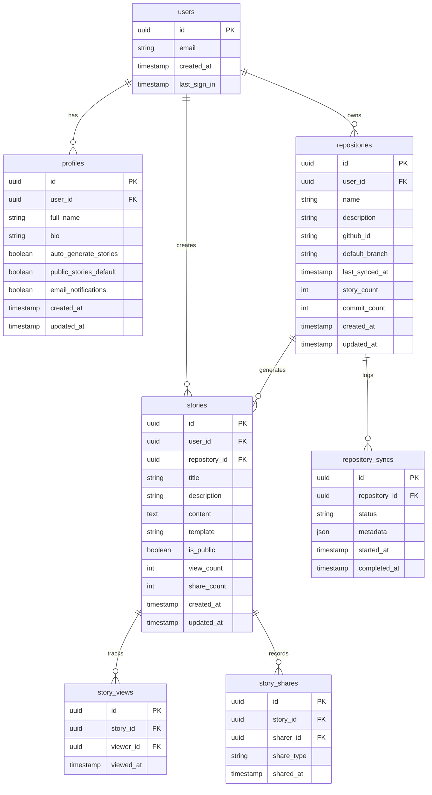

# Database Schema Documentation

## Overview

GitFables uses Supabase's PostgreSQL database with Row Level Security (RLS) policies. The schema is designed to support repository management, story generation, and user interactions.

## Entity Relationship Diagram



## Table Descriptions

### users

- Core user table managed by Supabase Auth
- Contains authentication and basic user information
- Referenced by all other user-related tables

### profiles

- Extended user information
- Preferences and settings
- One-to-one relationship with users

### repositories

- Connected GitHub repositories
- Tracks sync status and statistics
- Links repositories to users

### stories

- Generated stories from repositories
- Includes content and metadata
- Tracks visibility and engagement

### story_views

- Tracks story view history
- Used for analytics and engagement metrics
- Anonymous views supported

### story_shares

- Records story sharing events
- Tracks sharing method (social, link, embed)
- Used for engagement analytics

### repository_syncs

- Logs repository synchronization events
- Tracks sync status and metadata
- Used for debugging and monitoring

## Row Level Security Policies

### users

```sql
-- Users can only read their own data
CREATE POLICY "Users can read own data" ON users
    FOR SELECT USING (auth.uid() = id);
```

### profiles

```sql
-- Users can read their own profile
CREATE POLICY "Users can read own profile" ON profiles
    FOR SELECT USING (auth.uid() = user_id);

-- Users can update their own profile
CREATE POLICY "Users can update own profile" ON profiles
    FOR UPDATE USING (auth.uid() = user_id);
```

### repositories

```sql
-- Users can read their own repositories
CREATE POLICY "Users can read own repositories" ON repositories
    FOR SELECT USING (auth.uid() = user_id);

-- Users can create repositories
CREATE POLICY "Users can create repositories" ON repositories
    FOR INSERT WITH CHECK (auth.uid() = user_id);

-- Users can update their own repositories
CREATE POLICY "Users can update own repositories" ON repositories
    FOR UPDATE USING (auth.uid() = user_id);
```

### stories

```sql
-- Users can read public stories
CREATE POLICY "Users can read public stories" ON stories
    FOR SELECT USING (is_public = true);

-- Users can read their own stories
CREATE POLICY "Users can read own stories" ON stories
    FOR SELECT USING (auth.uid() = user_id);

-- Users can create stories
CREATE POLICY "Users can create stories" ON stories
    FOR INSERT WITH CHECK (auth.uid() = user_id);

-- Users can update their own stories
CREATE POLICY "Users can update own stories" ON stories
    FOR UPDATE USING (auth.uid() = user_id);
```

## Indexes

### Performance Indexes

```sql
-- Repositories
CREATE INDEX idx_repositories_user_id ON repositories(user_id);
CREATE INDEX idx_repositories_github_id ON repositories(github_id);
CREATE INDEX idx_repositories_last_synced_at ON repositories(last_synced_at);

-- Stories
CREATE INDEX idx_stories_user_id ON stories(user_id);
CREATE INDEX idx_stories_repository_id ON stories(repository_id);
CREATE INDEX idx_stories_created_at ON stories(created_at);
CREATE INDEX idx_stories_is_public ON stories(is_public);

-- Views and Shares
CREATE INDEX idx_story_views_story_id ON story_views(story_id);
CREATE INDEX idx_story_shares_story_id ON story_shares(story_id);
```

## Database Functions

### Story Generation

```sql
-- Increment story view count
CREATE FUNCTION increment_story_view(story_id UUID)
RETURNS void AS $$
BEGIN
    UPDATE stories
    SET view_count = view_count + 1
    WHERE id = story_id;
END;
$$ LANGUAGE plpgsql;

-- Increment story share count
CREATE FUNCTION increment_story_share(story_id UUID)
RETURNS void AS $$
BEGIN
    UPDATE stories
    SET share_count = share_count + 1
    WHERE id = story_id;
END;
$$ LANGUAGE plpgsql;
```

## Migrations

Migrations are managed through Supabase CLI and version controlled. Each migration includes:

- Up migration for applying changes
- Down migration for rollback
- Seed data if required
- RLS policies
- Function definitions

Example migration structure:

```sql
-- Migration: 20240101000000_create_base_schema.sql
-- Description: Initial schema setup

-- Up Migration
BEGIN;
  -- Create tables
  -- Add indexes
  -- Set up RLS
  -- Create functions
COMMIT;

-- Down Migration
BEGIN;
  -- Drop functions
  -- Drop tables
  -- Remove indexes
COMMIT;
```

## Backup & Recovery

1. **Automated Backups**

   - Daily point-in-time backups
   - 30-day retention
   - Stored in multiple regions

2. **Recovery Procedures**

   - Point-in-time recovery
   - Full database restore
   - Table-level recovery

3. **Monitoring**
   - Database size
   - Query performance
   - Connection pooling
   - Error rates
