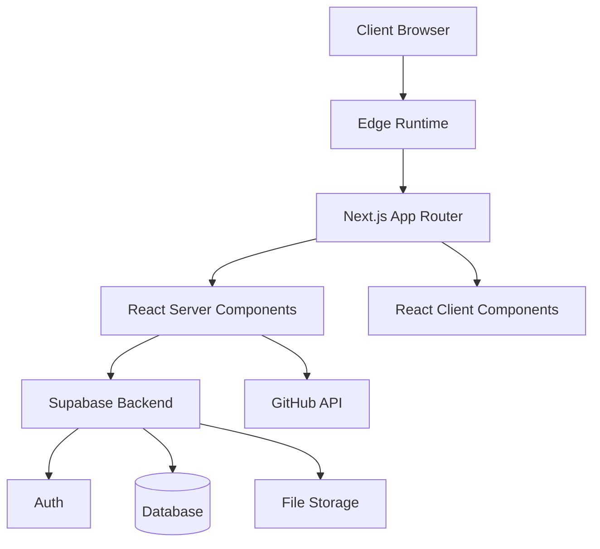
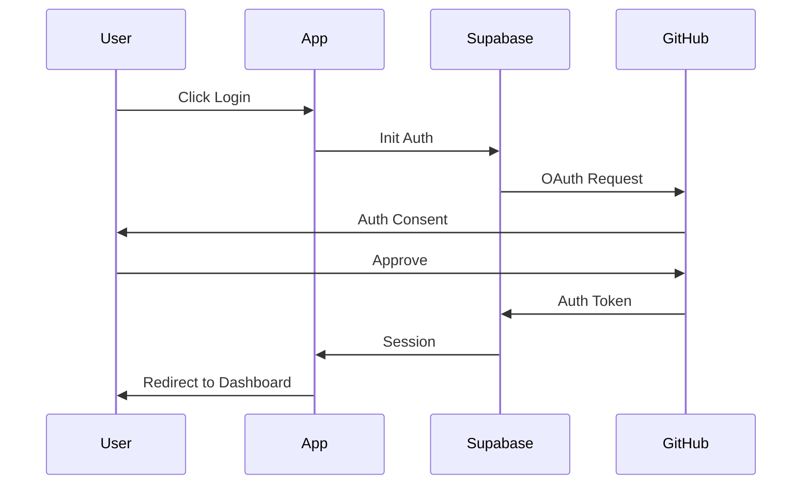
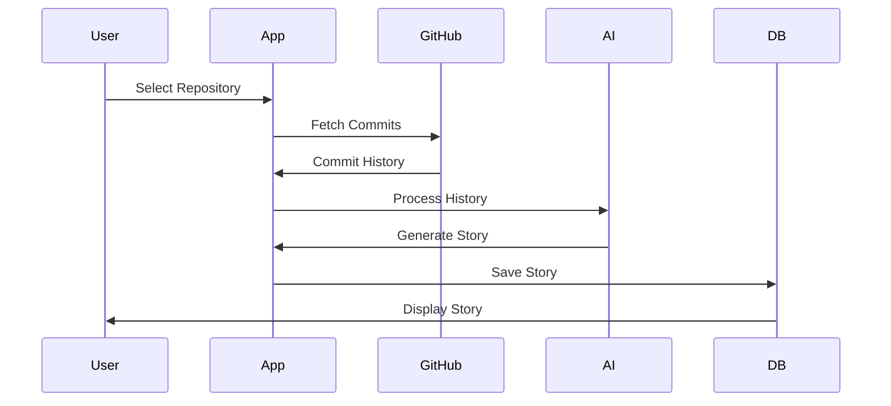

# GitFables Architecture Overview

## System Architecture

GitFables is built as a modern web application using Next.js 14 with a focus on server-side rendering, edge computing, and real-time capabilities.



## Tech Stack

### Frontend

- **Next.js 14**: App Router, Server Components, Edge Runtime
- **TypeScript**: Type-safe development
- **TailwindCSS**: Utility-first styling
- **shadcn/ui**: Component library
- **Lucide Icons**: Icon system

### Backend

- **Supabase**: Backend as a Service
  - PostgreSQL database
  - Row Level Security
  - Real-time subscriptions
  - Edge Functions
  - Auth with OAuth
  - File storage

### Infrastructure

- **Vercel**: Edge deployment
- **GitHub**: Version control, OAuth provider
- **OpenAI**: AI story generation

## Key Design Principles

1. **Server-First Architecture**

   - Leverage React Server Components
   - Minimize client-side JavaScript
   - Edge-optimized data fetching

2. **Type Safety**

   - Full TypeScript coverage
   - Generated database types
   - API type safety

3. **Security**

   - Row Level Security
   - OAuth integration
   - CSRF protection
   - Content security policies

4. **Performance**
   - Edge caching
   - Streaming responses
   - Optimized assets
   - Lazy loading

## Data Flow

### Authentication Flow



### Story Generation Flow



## Directory Structure

```
src/
├── app/                 # Next.js 14 app directory
│   ├── (marketing)/    # Marketing pages
│   ├── (dashboard)/    # Dashboard pages
│   ├── api/            # API routes
│   └── layout.tsx      # Root layout
├── components/         # React components
│   ├── ui/            # UI components
│   └── layout/        # Layout components
├── lib/               # Shared utilities
│   ├── supabase/      # Supabase clients
│   └── github/        # GitHub integration
└── types/             # TypeScript types
```

## Performance Considerations

1. **Edge Computing**

   - Deploy close to users
   - Minimize latency
   - Optimize caching

2. **Data Fetching**

   - Parallel requests
   - Streaming responses
   - Incremental loading

3. **Asset Optimization**

   - Image optimization
   - Font subsetting
   - Code splitting

4. **Caching Strategy**
   - Edge caching
   - Stale-while-revalidate
   - Persistent cache

## Security Measures

1. **Authentication**

   - OAuth 2.0
   - JWT tokens
   - Secure session handling

2. **Authorization**

   - Row Level Security
   - Role-based access
   - Scope-based permissions

3. **Data Protection**

   - Input validation
   - Output sanitization
   - SQL injection prevention

4. **Infrastructure**
   - SSL/TLS
   - CORS policies
   - Rate limiting

## Monitoring & Logging

1. **Application Metrics**

   - Request timing
   - Error rates
   - User activity

2. **Performance Monitoring**

   - Core Web Vitals
   - Time to First Byte
   - Time to Interactive

3. **Error Tracking**

   - Error boundaries
   - Stack traces
   - User context

4. **Analytics**
   - User behavior
   - Feature usage
   - Performance data

## Future Considerations

1. **Scalability**

   - Horizontal scaling
   - Load balancing
   - Database sharding

2. **Features**

   - Team collaboration
   - Advanced analytics
   - Custom templates

3. **Integration**
   - Additional VCS providers
   - CI/CD integration
   - Third-party tools
