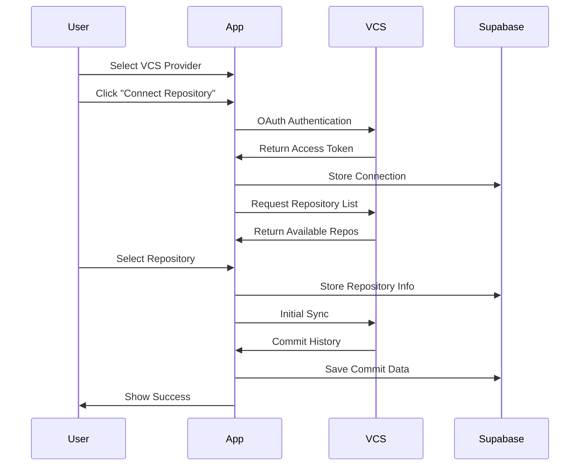

# Repository Management

## Overview

GitFables is designed to support multiple Version Control Systems (VCS), allowing users to connect and manage repositories from various providers. Currently, GitHub integration is available, with GitLab and Bitbucket support planned for future releases.

## Supported Providers

### Active Providers

- **GitHub**: Full integration with repository connection, sync, and story generation
  - OAuth authentication
  - Repository listing and selection
  - Commit history synchronization
  - User profile integration

### Future Providers (Currently Disabled)

- **GitLab**: Coming soon
- **Bitbucket**: Coming soon

## Connection Flow



## Implementation Details

### VCS Provider Interface

```typescript
interface VCSConnection {
  id: string
  user_id: string
  provider: 'github' | 'gitlab' | 'bitbucket'
  provider_user_id: string
  provider_username: string
  provider_email: string
  provider_avatar_url: string | null
  access_token: string
  refresh_token: string | null
  expires_at: string | null
  created_at: string
  updated_at: string
}

interface VCSProviderItem {
  id: string
  name: string
  icon: React.ComponentType<{ className?: string }>
  isActive: boolean
  comingSoon?: boolean
}
```

### Provider Configuration

```typescript
const providers: VCSProviderItem[] = [
  {
    id: 'github',
    name: 'GitHub',
    icon: GithubIcon,
    isActive: true,
  },
  {
    id: 'gitlab',
    name: 'GitLab',
    icon: GitlabIcon,
    isActive: false,
    comingSoon: true,
  },
  // Additional providers to be added
]
```

### OAuth Authentication

```typescript
const handleConnect = async (provider: VCSProviderItem) => {
  if (!provider.isActive) return

  try {
    const { error } = await supabase.auth.signInWithOAuth({
      provider: provider.id as 'github',
      options: {
        redirectTo: `${window.location.origin}/auth/callback`,
        scopes: 'repo read:user user:email',
      },
    })

    if (error) throw error
  } catch (err) {
    logError('Failed to connect to VCS provider', {
      metadata: {
        error: err,
        providerId: provider.id,
        providerName: provider.name,
      },
    })
  }
}
```

### Connection Management

The `useVCSConnections` hook provides functionality for managing VCS connections:

```typescript
const { connections, isLoading } = useVCSConnections()
```

Features:

- List active connections
- Connection status tracking
- Error handling
- Loading states

### UI Components

#### Provider List

```typescript
<div className="grid gap-4">
  {providers.map((provider) => {
    const connection = connections.find(c => c.provider === provider.id)
    const isConnected = !!connection

    return (
      <Button
        key={provider.id}
        variant={provider.isActive ? 'outline' : 'secondary'}
        className={cn(
          "justify-start",
          isConnected && "border-green-500"
        )}
        onClick={() => handleConnect(provider)}
        disabled={!provider.isActive || isLoading}
      >
        <provider.icon className="mr-2 h-5 w-5" />
        <span className="flex-1 text-left">
          {provider.name}
          {connection?.provider_username && (
            <span className="ml-2 text-xs text-muted-foreground">
              Connected as {connection.provider_username}
            </span>
          )}
          {provider.comingSoon && (
            <span className="ml-2 text-xs text-muted-foreground">
              Coming soon
            </span>
          )}
        </span>
        {isConnected && (
          <CheckCircle2Icon className="ml-2 h-4 w-4 text-green-500" />
        )}
      </Button>
    )
  })}
</div>
```

## Database Schema

### VCS Connections Table

```sql
create table vcs_connections (
  id uuid primary key default uuid_generate_v4(),
  user_id uuid references auth.users(id) on delete cascade,
  provider text not null check (provider in ('github', 'gitlab', 'bitbucket')),
  provider_user_id text not null,
  provider_username text not null,
  provider_email text not null,
  provider_avatar_url text,
  access_token text not null,
  refresh_token text,
  expires_at timestamp with time zone,
  created_at timestamp with time zone default now(),
  updated_at timestamp with time zone default now(),
  unique (user_id, provider)
);
```

## Future Enhancements

1. **GitLab Integration**

   - OAuth implementation
   - Repository sync
   - User profile integration

2. **Bitbucket Integration**

   - OAuth implementation
   - Repository sync
   - User profile integration

3. **Enhanced Sync Features**

   - Selective branch sync
   - Commit filtering
   - Incremental updates

4. **Advanced Repository Management**
   - Batch operations
   - Advanced filtering
   - Custom sync schedules
