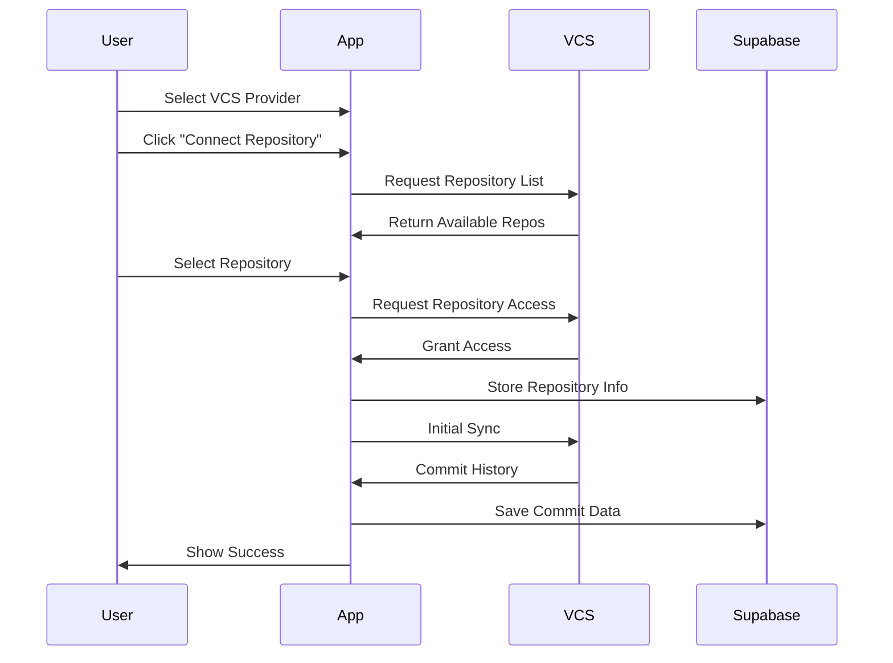

# Repository Management

## Overview

GitFables is designed to support multiple Version Control Systems (VCS), allowing users to connect and manage repositories from various providers. Currently, GitHub integration is available, with GitLab, Bitbucket, and Azure DevOps support planned for future releases.

## Supported Providers

### Active Providers

- **GitHub**: Full integration with repository connection, sync, and story generation

### Future Providers (Currently Disabled)

- **GitLab**: Coming soon
- **Bitbucket**: Coming soon
- **Azure DevOps**: Coming soon

## Connection Flow



## Features

### 1. Provider Selection

```typescript
interface VCSProvider {
  id: string
  name: string
  type: 'github' | 'gitlab' | 'bitbucket' | 'azure_devops'
  isActive: boolean
  icon: string
  authUrl: string
  scopes: string[]
}

const SUPPORTED_PROVIDERS: VCSProvider[] = [
  {
    id: 'github',
    name: 'GitHub',
    type: 'github',
    isActive: true,
    icon: '/icons/github.svg',
    authUrl: 'https://github.com/login/oauth/authorize',
    scopes: ['repo', 'read:user', 'read:org'],
  },
  {
    id: 'gitlab',
    name: 'GitLab',
    type: 'gitlab',
    isActive: false,
    icon: '/icons/gitlab.svg',
    authUrl: '',
    scopes: [],
  },
  // Additional providers...
]
```

### 2. Repository Connection

- Provider-agnostic interface
- OAuth-based authentication
- Repository selection interface
- Connection status tracking

### 3. Sync Mechanism

```typescript
interface SyncOptions {
  provider: string
  fullSync?: boolean
  branch?: string
  since?: Date
  until?: Date
}

async function syncRepository(repositoryId: string, options: SyncOptions) {
  const provider = getProviderClient(options.provider)
  // 1. Fetch repository metadata
  // 2. Get commit history
  // 3. Process commits
  // 4. Update sync status
}
```

#### Sync Types

1. **Initial Sync**

   - Full repository history
   - All branches
   - Complete metadata

2. **Incremental Sync**

   - New commits only
   - Active branch
   - Changed metadata

3. **Manual Sync**
   - User-triggered
   - Selected range
   - Specific branches

### 4. Data Management

#### Repository Data

```typescript
interface Repository {
  id: string
  user_id: string
  name: string
  description: string
  github_id: string
  default_branch: string
  last_synced_at: Date
  story_count: number
  commit_count: number
  created_at: Date
  updated_at: Date
}
```

#### Sync Status

```typescript
interface SyncStatus {
  status: 'pending' | 'in_progress' | 'completed' | 'failed'
  progress: number
  total_commits: number
  processed_commits: number
  error?: string
}
```

### 5. GitHub Integration

#### Required Scopes

- `repo`: Repository access
- `read:user`: User information
- `read:org`: Organization repositories

#### API Usage

```typescript
// Example: Fetching repository data
async function getRepositoryData(githubId: string) {
  const response = await octokit.request('GET /repositories/{id}', {
    id: githubId,
    headers: {
      'X-GitHub-Api-Version': '2022-11-28',
    },
  })
  return response.data
}
```

## User Interface

### 1. Provider Selection

```typescript
// Components/repositories/provider-selector.tsx
interface ProviderSelectorProps {
  providers: VCSProvider[]
  onSelect: (provider: VCSProvider) => void
}
```

Features:

- Provider cards with icons
- Active/disabled status indicators
- Coming soon badges
- Provider descriptions

### 2. Repository List

```typescript
// Components/repositories/repository-list.tsx
interface RepositoryListProps {
  provider: VCSProvider
  repositories: Repository[]
  onSync: (id: string) => void
  onDelete: (id: string) => void
}
```

Features:

- Repository cards
- Sync status indicators
- Action buttons
- Sort and filter options

### 3. Connection Dialog

```typescript
// Components/repositories/connect-dialog.tsx
interface ConnectDialogProps {
  isOpen: boolean
  onClose: () => void
  onConnect: (repo: GitHubRepository) => void
}
```

Steps:

1. GitHub authorization
2. Repository selection
3. Permission confirmation
4. Connection status

### 4. Repository Details

```typescript
// Components/repositories/repository-details.tsx
interface RepositoryDetailsProps {
  repository: Repository
  syncStatus: SyncStatus
  stories: Story[]
}
```

Information:

- Repository metadata
- Sync history
- Generated stories
- Analytics

## Permissions

### 1. Access Control

```sql
-- Repository access policy
CREATE POLICY "Users can access own repositories"
ON repositories
FOR ALL USING (
  auth.uid() = user_id
);
```

### 2. Organization Access

- Organization member validation
- Repository visibility check
- Team permission check

### 3. Rate Limiting

```typescript
const RATE_LIMITS = {
  connections_per_day: 10,
  syncs_per_hour: 5,
  concurrent_syncs: 2,
}
```

## Error Handling

### 1. Connection Errors

```typescript
try {
  await connectRepository(githubId)
} catch (error) {
  if (error.code === 'github/rate_limit') {
    // Handle rate limit
  } else if (error.code === 'github/not_found') {
    // Handle missing repository
  } else {
    // Handle other errors
  }
}
```

### 2. Sync Errors

- Network failures
- API limitations
- Permission changes
- Invalid states

### 3. Recovery Strategies

1. **Automatic Retry**

   - Exponential backoff
   - Maximum attempts
   - Status tracking

2. **Manual Recovery**
   - User notification
   - Retry options
   - Error details

## Monitoring

### 1. Sync Metrics

```typescript
interface SyncMetrics {
  total_repositories: number
  active_syncs: number
  failed_syncs: number
  average_sync_time: number
}
```

### 2. Performance Tracking

- API response times
- Sync duration
- Resource usage
- Error rates

### 3. Usage Analytics

- Connection patterns
- Sync frequency
- Story generation
- User engagement

## Best Practices

### 1. Repository Management

- Regular syncs
- Incremental updates
- Cache optimization
- Resource cleanup

### 2. Error Prevention

- Validation checks
- Permission verification
- Rate limit awareness
- Status monitoring

### 3. User Experience

- Clear feedback
- Progress indicators
- Error messages
- Recovery options

## Future Improvements

1. **Additional Providers**

   - GitLab integration (Planned)
   - Bitbucket support (Planned)
   - Azure DevOps integration (Planned)
   - Self-hosted Git servers

2. **Provider Features**

   - Provider-specific optimizations
   - Custom authentication flows
   - Provider-specific metadata
   - Cross-provider stories

3. **Integration Framework**

   - Provider adapter system
   - Common interface layer
   - Provider-specific extensions
   - Migration tools

4. **Performance**
   - Provider-optimized syncing
   - Parallel processing
   - Smart caching strategies
   - Resource management
