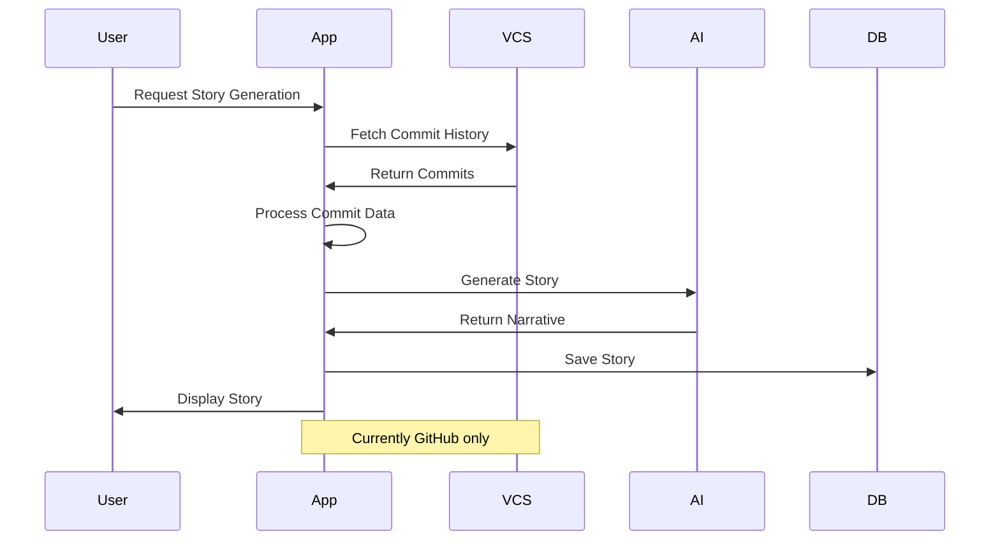

# Story Generation

## Overview

GitFables transforms repository commit history into engaging narratives using AI. The system is designed to work with multiple Version Control Systems (VCS), currently supporting GitHub repositories with planned support for other providers.

## Generation Process



## Features

### 1. Story Templates

```typescript
interface StoryTemplate {
  id: string
  name: string
  description: string
  style: 'narrative' | 'technical' | 'casual' | 'formal'
  tone: 'professional' | 'humorous' | 'dramatic'
  format: {
    sections: string[]
    variables: string[]
    maxLength: number
  }
  provider_compatibility: {
    github: boolean
    gitlab: boolean
    bitbucket: boolean
    azure_devops: boolean
  }
}

const SAMPLE_TEMPLATE: StoryTemplate = {
  id: 'journey-chronicle',
  name: 'Journey Chronicle',
  description: 'A narrative journey through your development timeline',
  style: 'narrative',
  tone: 'professional',
  format: {
    sections: ['intro', 'milestones', 'contributions', 'conclusion'],
    variables: ['repo_name', 'time_period', 'key_contributors'],
    maxLength: 2000,
  },
  provider_compatibility: {
    github: true, // Active
    gitlab: false, // Coming soon
    bitbucket: false, // Coming soon
    azure_devops: false, // Coming soon
  },
}
```

Available Templates:

1. **Journey Chronicle**

   - Development timeline
   - Key milestones
   - Team contributions

2. **Technical Digest**

   - Code changes
   - Architecture evolution
   - Performance improvements

3. **Team Story**
   - Collaboration highlights
   - Individual contributions
   - Project dynamics

### 2. AI Processing Pipeline

```typescript
interface CommitAnalysis {
  type: 'feature' | 'fix' | 'refactor' | 'docs' | 'other'
  impact: 'high' | 'medium' | 'low'
  sentiment: number
  keywords: string[]
  relatedIssues: string[]
  provider: {
    name: string
    version: string
    specific_metadata?: any
  }
}

async function analyzeCommits(
  commits: Commit[],
  provider: string
): Promise<CommitAnalysis[]> {
  const adapter = getProviderAdapter(provider)
  // 1. Use provider-specific adapter
  // 2. Normalize commit data
  // 3. Analyze standardized data
  // 4. Generate analysis
}
```

#### Processing Steps

1. **Data Collection**

   - Commit messages
   - Code changes
   - Issue references
   - Pull requests

2. **Analysis**

   - Pattern recognition
   - Sentiment analysis
   - Impact assessment
   - Relationship mapping

3. **Generation**
   - Template application
   - Content creation
   - Story structuring
   - Format optimization

### 3. Story Management

#### Story Data

```typescript
interface Story {
  id: string
  repository_id: string
  user_id: string
  provider: {
    name: string
    repository_url: string
    specific_data?: any
  }
  title: string
  description: string
  content: string
  template: string
  metadata: {
    commit_count: number
    date_range: {
      start: Date
      end: Date
    }
    contributors: string[]
    tags: string[]
    provider_specific?: any
  }
  is_public: boolean
  view_count: number
  share_count: number
  created_at: Date
  updated_at: Date
}
```

#### Story Operations

```typescript
// Story generation
async function generateStory(options: {
  repositoryId: string
  template: string
  dateRange?: { start: Date; end: Date }
  customization?: {
    focus?: string[]
    exclude?: string[]
    tone?: string
  }
}): Promise<Story>

// Story updates
async function updateStory(id: string, updates: Partial<Story>): Promise<Story>

// Story sharing
async function shareStory(id: string, platform: string): Promise<string>
```

### 4. Customization Options

```typescript
interface GenerationOptions {
  focus_areas?: string[]
  excluded_patterns?: string[]
  time_range?: DateRange
  contributors?: string[]
  style_preferences?: {
    tone: string
    format: string
    length: number
  }
}
```

## User Interface

### 1. Story Creation

```typescript
// Components/stories/story-generator.tsx
interface StoryGeneratorProps {
  repository: Repository
  templates: StoryTemplate[]
  onGenerate: (options: GenerationOptions) => Promise<Story>
}
```

Features:

- Template selection
- Customization options
- Preview capability
- Progress tracking

### 2. Story Display

```typescript
// Components/stories/story-viewer.tsx
interface StoryViewerProps {
  story: Story
  onShare: (platform: string) => void
  onEdit: () => void
}
```

Elements:

- Rich text content
- Code snippets
- Visualizations
- Share buttons

### 3. Story Management

```typescript
// Components/stories/story-list.tsx
interface StoryListProps {
  stories: Story[]
  onView: (id: string) => void
  onDelete: (id: string) => void
  onShare: (id: string) => void
}
```

Features:

- List/grid view
- Search & filter
- Bulk actions
- Analytics

## AI Integration

### 1. OpenAI Configuration

```typescript
interface AIConfig {
  model: string
  temperature: number
  max_tokens: number
  presence_penalty: number
  frequency_penalty: number
}

const STORY_GENERATION_CONFIG: AIConfig = {
  model: 'gpt-4',
  temperature: 0.7,
  max_tokens: 2000,
  presence_penalty: 0.6,
  frequency_penalty: 0.5,
}
```

### 2. Prompt Engineering

```typescript
function generatePrompt(data: {
  commits: Commit[]
  template: StoryTemplate
  options: GenerationOptions
}): string {
  // Create context-aware prompt
  // Include relevant commit data
  // Apply template structure
  // Add customization preferences
}
```

### 3. Output Processing

```typescript
interface AIResponse {
  content: string
  metadata: {
    tokens_used: number
    processing_time: number
    confidence_score: number
  }
}

function processAIOutput(response: AIResponse): Story {
  // Format content
  // Extract metadata
  // Apply styling
  // Validate output
}
```

## Performance Optimization

### 1. Caching Strategy

```typescript
interface CacheConfig {
  story_ttl: number
  template_ttl: number
  commit_cache_size: number
}

const CACHE_SETTINGS: CacheConfig = {
  story_ttl: 3600, // 1 hour
  template_ttl: 86400, // 1 day
  commit_cache_size: 1000,
}
```

### 2. Rate Limiting

```typescript
const RATE_LIMITS = {
  stories_per_day: 10,
  concurrent_generations: 2,
  tokens_per_minute: 10000,
}
```

### 3. Resource Management

- Batch processing
- Queue management
- Memory optimization
- Request throttling

## Error Handling

### 1. Generation Errors

```typescript
try {
  const story = await generateStory(options)
} catch (error) {
  if (error.code === 'ai/token_limit') {
    // Handle token limit
  } else if (error.code === 'ai/content_filter') {
    // Handle content filter
  } else {
    // Handle other errors
  }
}
```

### 2. Content Validation

- Format checking
- Content filtering
- Quality assurance
- Error recovery

### 3. User Feedback

- Progress updates
- Error messages
- Retry options
- Alternative suggestions

## Analytics

### 1. Generation Metrics

```typescript
interface GenerationMetrics {
  success_rate: number
  average_time: number
  token_usage: number
  error_rate: number
}
```

### 2. Usage Tracking

- Story views
- Share counts
- Template popularity
- User engagement

### 3. Quality Metrics

- Readability scores
- User ratings
- Completion rates
- Engagement time

## Future Improvements

1. **Advanced Features**

   - Multi-repository stories
   - Interactive elements
   - Custom templates
   - Real-time updates

2. **AI Enhancements**

   - Improved analysis
   - Better personalization
   - Multiple AI models
   - Context awareness

3. **User Experience**
   - Rich media support
   - Collaborative editing
   - Version control
   - Export options

## Provider Integration

### 1. Provider Adapters

```typescript
interface VCSProviderAdapter {
  name: string
  isActive: boolean
  fetchCommits(repoId: string, options: any): Promise<Commit[]>
  fetchContributors(repoId: string): Promise<Contributor[]>
  fetchMetadata(repoId: string): Promise<RepositoryMetadata>
  normalizeCommitData(commit: any): StandardizedCommit
}

// Currently active adapter
const GitHubAdapter: VCSProviderAdapter = {
  name: 'github',
  isActive: true,
  // Implementation
}

// Future adapters (disabled)
const GitLabAdapter: VCSProviderAdapter = {
  name: 'gitlab',
  isActive: false,
  // Implementation pending
}
```

### 2. Data Normalization

```typescript
interface StandardizedCommit {
  id: string
  message: string
  author: {
    name: string
    email: string
  }
  timestamp: Date
  changes: {
    files: number
    additions: number
    deletions: number
  }
  // Common fields across all providers
}
```

1. **Provider Support**

   - GitLab integration (Planned)
   - Bitbucket support (Planned)
   - Azure DevOps integration (Planned)
   - Provider-specific optimizations

2. **Cross-Provider Features**

   - Multi-repository stories across providers
   - Provider-specific templates
   - Unified commit analysis
   - Cross-provider statistics

3. **Advanced Analysis**
   - Provider-specific insights
   - Custom provider rules
   - Enhanced metadata usage
   - Provider comparison analytics
