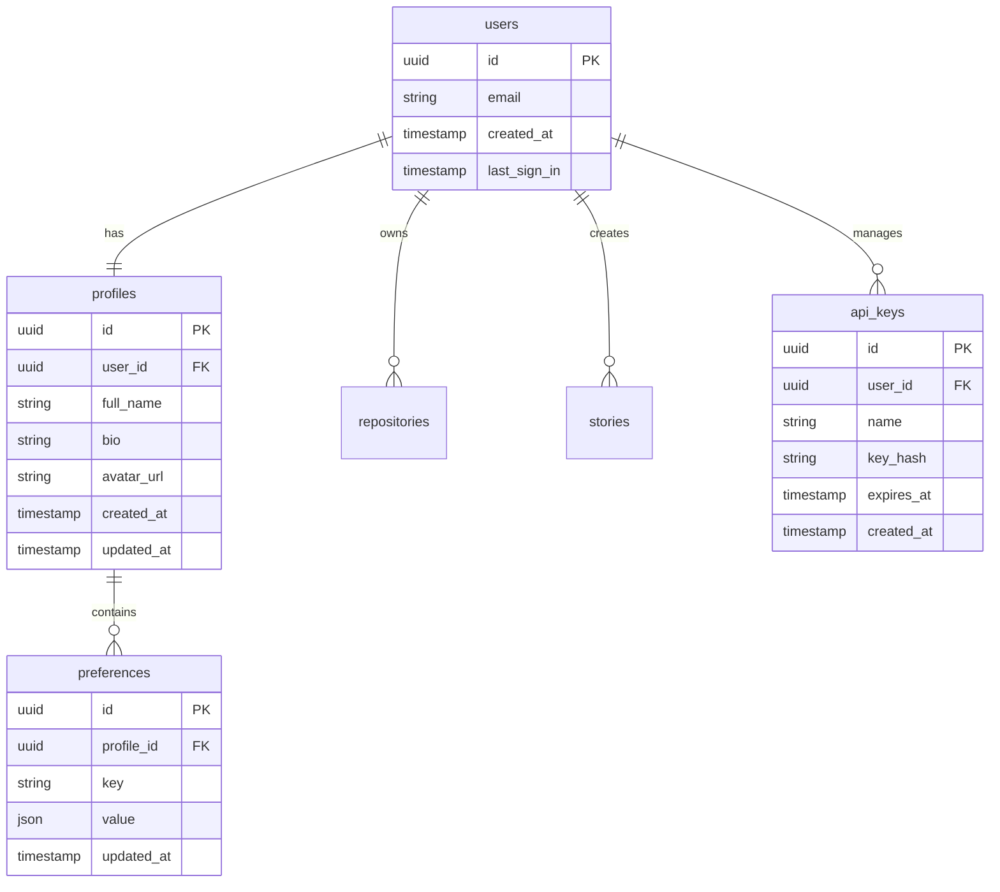

# User Management

## Overview

GitFables provides comprehensive user management features including authentication, profile management, preferences, and analytics. The system uses Supabase Auth for secure user authentication and management.

## User Data Model



## Features

### 1. User Authentication

```typescript
interface AuthOptions {
  provider: 'github' | 'email'
  redirect_url?: string
  scopes?: string[]
}

async function authenticateUser(options: AuthOptions): Promise<Session> {
  // Handle authentication flow
  // Validate credentials
  // Create session
  // Set up profile
}
```

#### Authentication Methods

1. **GitHub OAuth**

   - OAuth flow
   - Scope management
   - Token handling

2. **Email/Password**
   - Secure storage
   - Password rules
   - Reset flow

### 2. Profile Management

```typescript
interface Profile {
  id: string
  user_id: string
  full_name: string
  bio: string
  avatar_url: string
  social_links: {
    github?: string
    twitter?: string
    linkedin?: string
  }
  preferences: {
    theme: 'light' | 'dark' | 'system'
    email_notifications: boolean
    auto_sync: boolean
  }
  created_at: Date
  updated_at: Date
}
```

#### Profile Operations

```typescript
// Update profile
async function updateProfile(
  userId: string,
  updates: Partial<Profile>
): Promise<Profile>

// Get profile
async function getProfile(userId: string): Promise<Profile>

// Delete profile
async function deleteProfile(userId: string): Promise<void>
```

### 3. User Settings

```typescript
interface UserSettings {
  theme: {
    mode: 'light' | 'dark' | 'system'
    accent_color: string
  }
  notifications: {
    email: boolean
    web: boolean
    digest: 'daily' | 'weekly' | 'never'
  }
  privacy: {
    public_profile: boolean
    show_activity: boolean
    default_story_visibility: 'public' | 'private'
  }
  repository: {
    auto_sync: boolean
    sync_frequency: 'hourly' | 'daily' | 'weekly'
    default_branch: string
  }
}
```

### 4. API Key Management

```typescript
interface APIKey {
  id: string
  user_id: string
  name: string
  key: string
  scopes: string[]
  expires_at: Date
  created_at: Date
}

async function generateAPIKey(options: {
  name: string
  scopes: string[]
  expires_in?: number
}): Promise<APIKey>
```

## User Interface

### 1. Profile Editor

```typescript
// Components/users/profile-editor.tsx
interface ProfileEditorProps {
  profile: Profile
  onSave: (updates: Partial<Profile>) => Promise<void>
}
```

Features:

- Personal information
- Social links
- Avatar upload
- Bio editor

### 2. Settings Panel

```typescript
// Components/users/settings-panel.tsx
interface SettingsPanelProps {
  settings: UserSettings
  onChange: (key: string, value: any) => void
  onSave: () => Promise<void>
}
```

Sections:

- Appearance
- Notifications
- Privacy
- Repository
- API Keys

### 3. Activity Dashboard

```typescript
// Components/users/activity-dashboard.tsx
interface ActivityDashboardProps {
  userId: string
  timeRange: 'week' | 'month' | 'year'
  onFilterChange: (filters: any) => void
}
```

Features:

- Activity timeline
- Story statistics
- Repository insights
- Usage metrics

## Security

### 1. Authentication Security

```typescript
const AUTH_CONFIG = {
  password_min_length: 12,
  password_require_special: true,
  password_require_numbers: true,
  max_login_attempts: 5,
  lockout_duration: 15 * 60, // 15 minutes
}
```

### 2. Session Management

```typescript
interface SessionConfig {
  max_age: number
  refresh_threshold: number
  inactive_timeout: number
}

const SESSION_CONFIG: SessionConfig = {
  max_age: 7 * 24 * 60 * 60, // 7 days
  refresh_threshold: 60 * 60, // 1 hour
  inactive_timeout: 30 * 60, // 30 minutes
}
```

### 3. API Key Security

```typescript
interface APIKeyPolicy {
  max_keys_per_user: number
  max_scope_per_key: string[]
  key_expiry_max: number
}

const API_KEY_POLICY: APIKeyPolicy = {
  max_keys_per_user: 5,
  max_scope_per_key: ['read', 'write', 'delete'],
  key_expiry_max: 365 * 24 * 60 * 60, // 1 year
}
```

## Privacy

### 1. Data Protection

```typescript
interface PrivacySettings {
  data_retention: {
    account_deletion: number
    inactive_account: number
    api_logs: number
  }
  data_access: {
    require_2fa: boolean
    ip_whitelist: boolean
    audit_logging: boolean
  }
}
```

### 2. Data Export

```typescript
interface ExportOptions {
  include_stories: boolean
  include_repositories: boolean
  include_settings: boolean
  format: 'json' | 'csv'
}

async function exportUserData(
  userId: string,
  options: ExportOptions
): Promise<Blob>
```

### 3. Account Deletion

```typescript
interface DeletionOptions {
  delete_stories: boolean
  delete_repositories: boolean
  export_data: boolean
}

async function deleteAccount(
  userId: string,
  options: DeletionOptions
): Promise<void>
```

## Analytics

### 1. User Metrics

```typescript
interface UserMetrics {
  stories_generated: number
  repositories_connected: number
  total_views: number
  active_days: number
}
```

### 2. Usage Tracking

```typescript
interface UsageStats {
  api_calls: number
  storage_used: number
  generation_tokens: number
  feature_usage: Record<string, number>
}
```

### 3. Activity Monitoring

- Login history
- Feature usage
- Error tracking
- Performance metrics

## Error Handling

### 1. Authentication Errors

```typescript
try {
  await authenticateUser(options)
} catch (error) {
  if (error.code === 'auth/invalid_credentials') {
    // Handle invalid credentials
  } else if (error.code === 'auth/rate_limit') {
    // Handle rate limiting
  } else {
    // Handle other errors
  }
}
```

### 2. Profile Errors

- Validation errors
- Update failures
- Permission issues
- Constraint violations

### 3. Settings Errors

- Invalid values
- Save failures
- Sync issues
- Conflict resolution

## Future Improvements

1. **Enhanced Security**

   - Multi-factor authentication
   - SSO integration
   - Biometric authentication
   - Hardware key support

2. **Advanced Features**

   - Team management
   - Role-based access
   - Custom permissions
   - Audit logging

3. **User Experience**
   - Onboarding flow
   - Profile templates
   - Bulk operations
   - Integration options
